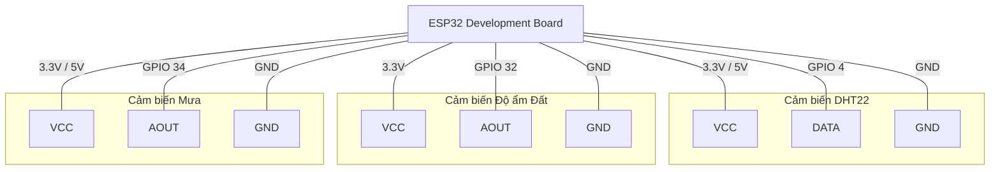
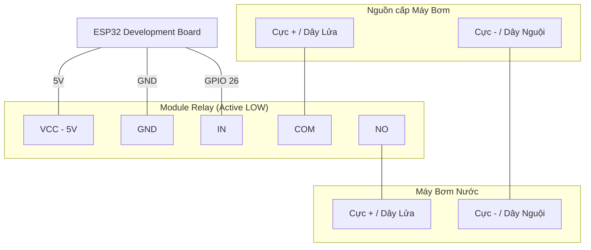

# Hướng dẫn Lắp đặt Phần cứng & Đánh giá Firmware Smart Garden

Tài liệu này cung cấp hướng dẫn đấu nối phần cứng cho hệ thống Smart Garden (bao gồm **Node Cảm biến** và **Node Máy bơm**) dựa trên cấu hình chân trong mã nguồn, đồng thời phân tích, đánh giá các chức năng hiện tại của firmware và chỉ ra các lỗi cần khắc phục để hệ thống hoạt động trơn tru.

---

## 1. Sơ đồ & Hướng dẫn Đấu nối Phần cứng

Hệ thống hoạt động với hai board điều khiển ESP32 độc lập: **Sensor Node (Node Cảm biến)** và **Pump Node (Node Máy bơm)**.

### 1.1. Sensor Node (Node Cảm biến)

Node này thực hiện việc đọc dữ liệu từ cảm biến nhiệt độ - độ ẩm không khí (DHT22), độ ẩm đất (Analog Soil Moisture) và cảm biến mưa (Rain Sensor), sau đó gửi dữ liệu này lên MQTT Broker.

#### Bảng sơ đồ nối chân (Sensor Board):
| Thiết bị / Cảm biến | Chân Cảm biến | Chân ESP32 (GPIO) | Ghi chú |
| :--- | :--- | :--- | :--- |
| **DHT22** (Nhiệt độ & Độ ẩm) | VCC | 3.3V hoặc 5V | Nguồn cấp cho cảm biến |
| | GND | GND | Cực âm chung |
| | DATA | **GPIO 4** | Cấu hình qua `DHT_PIN` trong `Config.h` |
| **Soil Moisture Sensor** | VCC | 3.3V | Cần nguồn 3.3V để tránh ăn mòn nhanh |
| (Cảm biến độ ẩm đất - Analog) | GND | GND | Cực âm chung |
| | AOUT | **GPIO 32** | Cấu hình qua `SOIL_ADC_PIN` trong `Config.h` |
| **Rain Sensor** | VCC | 3.3V hoặc 5V | Nguồn cấp |
| (Cảm biến mưa - Analog) | GND | GND | Cực âm chung |
| | AOUT (Analog Out) | **GPIO 34** | Cấu hình qua `RAIN_ADC_PIN` trong `Config.h` |
| | DO (Digital Out) | *Không nối* | Chân `RAIN_DIGITAL_PIN (GPIO 35)` không dùng trong code |

#### Sơ đồ kết nối:


---

### 1.2. Pump Node (Node Máy bơm)

Node này nhận lệnh từ Web Dashboard qua MQTT Broker để điều khiển đóng ngắt relay kích hoạt máy bơm nước.

#### Bảng sơ đồ nối chân (Pump Board):
| Thiết bị | Chân thiết bị | Chân ESP32 (GPIO) / Đấu nối | Ghi chú |
| :--- | :--- | :--- | :--- |
| **Relay Module** | VCC | 5V (hoặc 3.3V) | Cấp nguồn nuôi Relay |
| (Kích mức thấp - Active LOW) | GND | GND | Cực âm chung |
| | IN (Signal) | **GPIO 26** | Cấu hình qua `RELAY_PIN` trong `Config.h` |
| **Tải & Nguồn Bơm** | COM (Relay) | Cực dương (+) Nguồn Bơm | Đấu nối tiếp để đóng/ngắt |
| | NO (Relay) | Cực dương (+) Máy Bơm | Thường mở, đóng khi relay kích hoạt |
| | Cực âm (-) Nguồn Bơm | Cực âm (-) Máy Bơm | Đấu trực tiếp |

> [!IMPORTANT]
> Relay được cấu hình hoạt động ở chế độ kích mức thấp (Active LOW):
> - Khi chân GPIO 26 xuất mức **LOW (0)**: Rơ-le đóng (COM nối NO) $\rightarrow$ Máy bơm chạy.
> - Khi chân GPIO 26 xuất mức **HIGH (1)**: Rơ-le ngắt (COM hở NO) $\rightarrow$ Máy bơm dừng.

#### Sơ đồ kết nối điều khiển bơm:


---

## 2. Hướng dẫn Nạp Chương trình & Cấu hình WiFi

### 2.1. Cấu hình ban đầu
Các thông số WiFi và MQTT mặc định được đặt trong `firmware/src/Config.h`. Bạn cũng có thể thiết lập chúng trực tiếp trong `firmware/platformio.ini` thông qua các cờ `build_flags` (ví dụ `-DWIFI_SSID=\"SSID_Cua_Ban\"`).

### 2.2. Biên dịch và nạp code qua PlatformIO CLI
Mở terminal tại thư mục gốc của project và chạy các lệnh tương ứng cho từng thiết bị:

- **Nạp chương trình cho Node Cảm biến (Sensor) kết nối Cloud (HiveMQ):**
  ```bash
  pio run -d firmware -e sensor_esp32 --target upload
  ```
- **Nạp chương trình cho Node Cảm biến (Sensor) kết nối Local Broker:**
  ```bash
  pio run -d firmware -e sensor_esp32_local --target upload
  ```
- **Nạp chương trình cho Node Máy Bơm (Pump) kết nối Cloud (HiveMQ):**
  ```bash
  pio run -d firmware -e pump_esp32 --target upload
  ```
- **Nạp chương trình cho Node Máy Bơm (Pump) kết nối Local Broker:**
  ```bash
  pio run -d firmware -e pump_esp32_local --target upload
  ```

### 2.3. Cổng cấu hình WiFi (Web Portal AP Provisioning)
Nếu ESP32 không thể kết nối tới WiFi đã cấu hình sau 5 giây (`WIFI_CONNECT_TIMEOUT_MS`), nó sẽ tự động chuyển sang chế độ Access Point (AP) để cấu hình thủ công:
1. Sử dụng điện thoại hoặc máy tính kết nối tới mạng Wi-Fi phát ra có tên là **SmartGarden** (không mật khẩu).
2. Mở trình duyệt web và truy cập địa chỉ IP: `http://192.168.4.1`
3. Nhập SSID và Password của mạng WiFi nhà bạn, sau đó nhấn **Save & Connect**. Thiết bị sẽ lưu thông tin vào bộ nhớ flash (Preferences) và tự động khởi động lại để kết nối.

---

## 3. Đánh giá Chức năng Firmware & Báo cáo Lỗi

Sau khi kiểm tra kỹ lưỡng mã nguồn của Firmware và Web Server, dưới đây là kết quả kiểm tra độ hoàn thiện của các chức năng gửi nhận dữ liệu và điều khiển:

### 3.1. Các chức năng đã hoạt động đúng thiết kế
1. **Đọc dữ liệu cảm biến & Tính toán AI**: Node cảm biến đọc thành công DHT22, tính toán độ ẩm đất tỷ lệ % (0% là khô hoàn toàn, 100% là ướt hoàn toàn nhờ thuật toán đảo ngược ADC), phân loại cường độ mưa (0, 1, 2) và tính toán thời gian đất khô cạn (Dryout Prediction) bằng mô hình tuyến tính tích hợp sẵn trên chip.
2. **Gửi dữ liệu qua MQTT**: Dữ liệu thời tiết, độ ẩm đất, dự đoán AI và heartbeat được đóng gói định dạng JSON và publish chính xác lên các topic tương ứng.
3. **Phản hồi trạng thái bơm**: Bơm có khả năng phản hồi trạng thái hoạt động thực tế (Running/Idle, thời gian còn lại) định kỳ và khi có sự thay đổi trạng thái về máy chủ.
4. **Nhận lệnh điều khiển bơm**: Bơm lắng nghe lệnh bật từ Web trên topic `smartgarden/PUMP_001/pump/command`, kích hoạt relay bật bơm và tự động tắt sau khi hết thời gian chạy (`duration` tính bằng giây).

---

### 3.2. CÁC LỖI NGHIÊM TRỌNG ĐÃ ĐƯỢC KHẮC PHỤC (BUGS FIXED)

**Lưu ý:** Các lỗi này đã được tôi chỉnh sửa trực tiếp vào mã nguồn trong kho lưu trữ. Dưới đây là thông tin chi tiết về từng lỗi và vị trí đã sửa để bạn tiện theo dõi:

#### ❌ Lỗi 1: Thiếu cấu hình Server cho MQTT Client (Lỗi nghiêm trọng nhất - Fatal Bug) - ĐÃ SỬA
* **Chi tiết**: Trong `firmware/src/MqttManager.cpp`, đối tượng `PubSubClient _client` được khởi tạo nhưng **hoàn toàn không được thiết lập địa chỉ IP broker và cổng** (không gọi hàm `_client.setServer(...)`). Điều này khiến hàm `connect()` luôn thất bại vì client không biết phải kết nối đi đâu.
* **Cách sửa (Đã áp dụng)**: Thêm dòng cấu hình server vào constructor của `MqttManager` trong file [MqttManager.cpp](file:///d:/Truong/Code/project_20252/smart-garden-rework/firmware/src/MqttManager.cpp).

```diff
MqttManager::MqttManager(const char* deviceCode)
  : _client(_wifiClient), _reconnectInterval(MQTT_RECONNECT_INITIAL_MS) {
  strncpy(_deviceCode, deviceCode, sizeof(_deviceCode) - 1);
  _deviceCode[sizeof(_deviceCode) - 1] = '\0';

  _client.setBufferSize(MQTT_BUFFER_SIZE);
  _client.setKeepAlive(15);
+ _client.setServer(MQTT_BROKER, MQTT_PORT);

#ifdef MQTT_USE_TLS
  // HiveMQ Cloud: TLS required
  _wifiClient.setInsecure();  // HiveMQ uses a wildcard cert per region
#endif
}
```

---

#### ❌ Lỗi 2: Node Cảm biến không đăng ký nhận tin nhắn MQTT (Missing Subscriptions) - ĐÃ SỬA
* **Chi tiết**: Trong `sensor_esp32.cpp`, mã nguồn có viết logic callback xử lý khi nhận được lệnh Reset Wi-Fi (`TOPIC_RESET_COMMAND`) và cập nhật thời điểm tưới nước từ máy bơm (`TOPIC_PUMP_STATUS`). Tuy nhiên, trong hàm `setup()`, node cảm biến **chưa từng gọi hàm đăng ký (subscribe)** các topic này. Vì thế, Node cảm biến sẽ không bao giờ nhận được lệnh xóa WiFi từ xa hay cập nhật dữ liệu tưới nước.
* **Cách sửa (Đã áp dụng)**: Thêm các dòng đăng ký subscribe sau khi kết nối thành công trong hàm `setup()` của file [sensor_esp32.cpp](file:///d:/Truong/Code/project_20252/smart-garden-rework/firmware/src/sensor_esp32.cpp).

```diff
  _mqtt->connect();
  
+ // Đăng ký nhận lệnh reset WiFi từ xa
+ char resetTopic[64];
+ snprintf(resetTopic, sizeof(resetTopic), TOPIC_RESET_COMMAND, DEVICE_CODE);
+ _mqtt->subscribe(resetTopic, QOS_COMMAND);
+
+ // Đăng ký nhận trạng thái hoạt động của bơm để đồng bộ hóa AI
+ char statusTopic[64];
+ snprintf(statusTopic, sizeof(statusTopic), TOPIC_PUMP_STATUS, "PUMP_001");
+ _mqtt->subscribe(statusTopic, QOS_TELEMETRY);

  // Initial reads
  readAndPublishSensors();
```

---

#### ❌ Lỗi 3: Node Bơm không đăng ký nhận lệnh Reset WiFi từ xa - ĐÃ SỬA
* **Chi tiết**: Tương tự như Node cảm biến, trong `pump_esp32.cpp` callback có xử lý lệnh reset từ topic `/reset/command` nhưng hàm `setup()` chỉ subscribe duy nhất topic nhận lệnh bật tắt bơm mà bỏ quên đăng ký nhận lệnh reset.
* **Cách sửa (Đã áp dụng)**: Thêm lệnh đăng ký nhận lệnh reset trong hàm `setup()` của file [pump_esp32.cpp](file:///d:/Truong/Code/project_20252/smart-garden-rework/firmware/src/pump_esp32.cpp).

```diff
  char commandTopic[64];
  snprintf(commandTopic, sizeof(commandTopic), TOPIC_PUMP_COMMAND, DEVICE_CODE);
  _mqtt->subscribe(commandTopic, QOS_COMMAND);
  Serial.printf("[MQTT] Subscribed: %s\n", commandTopic);

+ // Đăng ký nhận lệnh reset WiFi từ xa
+ char resetTopic[64];
+ snprintf(resetTopic, sizeof(resetTopic), TOPIC_RESET_COMMAND, DEVICE_CODE);
+ _mqtt->subscribe(resetTopic, QOS_COMMAND);
+ Serial.printf("[MQTT] Subscribed: %s\n", resetTopic);

  Serial.println("=== Pump Ready ===");
```

---

#### ⚠️ Lưu ý 4: Chức năng cấu hình WiFi tự động bằng ESP-NOW (Chưa hoàn thiện)
* **Chi tiết**: Trong dự án có xây dựng module `EspNowManager` nhằm mục đích truyền thông tin WiFi từ bơm sang cảm biến (không cần cấu hình thủ công 2 lần). Tuy nhiên, Node cảm biến (`sensor_esp32.cpp`) hoàn toàn không khai báo hay khởi tạo module này, còn Node bơm (`pump_esp32.cpp`) có khởi tạo nhưng không gọi hàm truyền tin.
* **Đánh giá**: Tính năng này hiện tại **không hoạt động**. Bạn nên sử dụng phương pháp cấu hình WiFi độc lập cho từng node qua Cổng cấu hình Web (Web AP Provisioning Portal) ở Mục 2.3.
